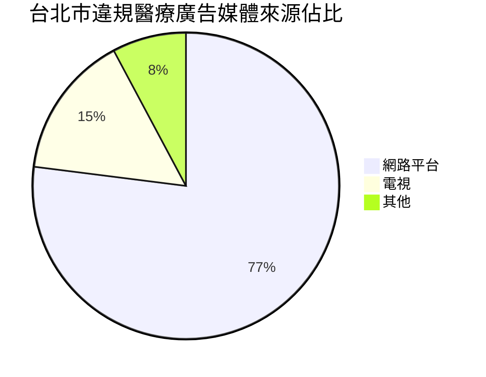

# 紅線之外：為何您的牙醫廣告隨時可能觸法？

張院長走進診所時，臉上還帶著笑容。他剛完成了新診所的社群媒體規劃，Instagram、Facebook和LINE官方帳號全數上線，更精心設計了一套「開幕慶優惠」方案——植牙85折、全瓷冠限時特價、新客檢查免費——這些促銷手法在其他產業早已司空見慣。

但一個月後，他卻收到了衛生局的行政處分通知：因違反醫療法第86條醫療廣告相關規定，處新台幣10萬元罰鍰。

「我只是像其他商家一樣做行銷，為什麼會違法？」張院長的困惑，正是無數牙醫診所經營者的共同心聲。

在台灣嚴格的醫療廣告法規框架下，牙醫診所的行銷推廣猶如在布滿地雷的區域跳舞——稍有不慎，就可能觸發法規紅線，面臨高額罰款、形象受損，甚至執照危機。本文將帶您深入探索這個「不能說的秘密」：牙醫診所廣告中的紅線與灰色地帶。

## 令人窒息的數字：醫療廣告違規罰鍰已成「億」級災難

  <h4>驚人的違規數據 (2024年統計)</h4>
  <ul>
    <li><strong>全國總罰鍰</strong>: 違規廣告罰鍰總額高達 <strong>3.7億</strong> 新台幣</li>
    <li><strong>全國總案件數</strong>: 共計 <strong>8,006件</strong> 食品、藥物、化妝品違規廣告案</li>
    <li><strong>牙醫診所佔比</strong>: 在醫療廣告違規案中，牙醫診所相關案件佔比達 <strong>31%</strong>，成為重點監管對象</li>
  </ul>

「疫情後，大家都在搶占數位行銷市場，但對醫療機構而言，這卻是一場隱藏風險的競賽。」衛福部醫事司一位不願具名的官員如此表示。

根據衛福部公開資料，2023年全台醫療廣告違規案例中，牙醫診所以28%的比例居各科之冠，罰款金額累計超過1,200萬元。更值得注意的是，有高達62%的案例屬於「累犯」——診所在不了解法規的情況下，一錯再錯，導致處罰加重。

「等到收到罰單才警覺，已經太遲了。」有超過十年執業經驗的林醫師坦言，「在現在的環境下，不懂法規比不懂診療更危險。」

## 為何牙醫診所成為醫療廣告處分「重災區」？

在一座醫療大樓裡，三樓和四樓分別有兩家牙醫診所。為了吸引患者上樓，兩家診所不約而同地在社群媒體上發起促銷活動，一個月後，兩家都收到了罰單。這並非偶然個案，而是台灣牙醫診所普遍面臨的困境。

深入分析牙醫診所成為違規重災區的結構性原因，主要包括：

1. **競爭強度遠超其他科別**：台灣牙醫診所密度高居亞洲前列，每2,900人就有一家診所，在都會區這個數字更低至每1,800人。如此激烈的競賽環境，迫使許多診所透過積極行銷來爭取患者。

2. **自費項目比重高，患者更注重價格比較**：相較於其他科別，牙醫的自費項目比例高達70%以上。植牙、矯正、美白等高價值項目使得患者更傾向貨比三家，診所也因此更依賴價格導向的行銷手法。

3. **數位行銷成為違規主渠道**：根據最新統計，高達 **77%** 的違規醫療廣告來自網路平台。其中公司官網(41%)與社群媒體(33%)是主要來源。這顯示多數診所雖積極投入數位行銷，卻對其法規風險認知不足。

4. **第三方行銷公司缺乏醫療法規專業**：許多診所委託普通行銷公司操作社群媒體，這些公司擅長商業行銷但對醫療特殊法規認知不足，無形中將診所推向違規邊緣。

5. **行政裁罰標準差異大且不透明**：各地方衛生局對同類違規行為的裁罰標準不一，造成診所經營者對"紅線"認知模糊。台北市與新北市的同類案件，罰款金額最高可相差3倍。

「問題不在於診所有意規避法規，而是真的不知道界限在哪裡。」台灣牙醫師公會全國聯合會一位幹部表示，「許多診所被罰了才知道原來這也不行，那時已經太遲了。」

## 一步踩錯，代價沉重：醫療廣告法規的嚴厲現實

想像一下：一則看似無害的社群貼文，可能導致罰款、醫師記點、形象受損甚至執照危機，這就是台灣醫療廣告法規的嚴厲現實。

醫師法、醫療法、醫療機構網際網路資訊管理辦法——這些法規共同形成了對醫療廣告的嚴格監管框架。在這個框架下，一個小小的行銷決策失誤可能引發連鎖反應：

  <h4>真實案例：單一貼文引發的連鎖災難</h4>
  
新北市某牙醫診所的社群媒體專員，在歡慶母親節時發布了「感恩母親節，全瓷冠85折優惠」的Instagram貼文。這則貼文自動同步至診所LINE官方帳號，引發了一系列後果：

  <ol>
    <li><strong>雙重處罰</strong>：衛生局認定這是「多平台違規」，分別對Instagram和LINE的內容各處分5萬元，共10萬元。</li>
    <li><strong>醫師連帶責任</strong>：主治醫師因未盡審核責任，遭醫師公會懲處並記點，影響後續執業評鑑。</li>
    <li><strong>民事賠償風險</strong>：一位看到廣告來診的患者因對治療結果不滿，引用廣告內容作為「療效承諾」提起民事訴訟。</li>
    <li><strong>品牌形象受損</strong>：處分被登載於衛生局網站，當地媒體以「牙醫診所違規廣告」為題進行報導，對診所聲譽造成負面影響。</li>
  </ol>
  
「一則貼文，毀了我們辛苦建立的形象。」該診所院長表示，「更糟的是，即使刪除了貼文，互聯網上的痕跡卻難以完全消除。」

醫療法第85條明確規定：「非醫療機構，不得為醫療廣告」，第86條則限制了廣告內容，包括禁止誇大、保證、暗示療效等。違反者最高可處新台幣50萬元罰鍰，情節重大者甚至可處以停業處分。

值得注意的是，醫療廣告的責任歸屬既及機構也及人——診所負責人和相關醫師都可能面臨連帶處分。在累犯情況下，甚至可能影響醫師的執照續期評鑑。

## 灰色地帶：日常行銷中的隱形地雷

「我不是故意要違規，只是不知道原來這也不行。」這是許多被處分診所負責人的共同辯解。最讓診所經營者頭痛的，莫過於那些看似日常卻潛藏風險的行銷手法。讓我們深入探討這些灰色地帶：

### 1. 價格促銷類地雷

王醫師經營的診所剛好位於一家知名連鎖服飾品牌旁邊。每當服飾店掛出「全場7折」的布條時，診所門口總是門可羅雀。「如果我們也能這樣明碼標價做促銷，該有多好？」王醫師常這樣想。然而，醫療服務的特殊性決定了它不能被當作一般商品對待。

「優惠」、「折扣」、「限時特價」——這些電商平台習以為常的促銷詞彙，在醫療廣告中卻可能被視為「不正當方式爭取病人」。2023年，共有58家牙醫診所因價格促銷類廣告被處分，佔總處分案件的25%。

常見違規示例：
- 「週年慶：全瓷冠85折，植牙現折萬元」
- 「光電購物節1+1必搶套餐價1111元」
- 「一日全口重建/速定植牙...素人專案甜甜價」
- 「新開幕免掛號費」或贈送價值2,000元洗牙療程
- 「學生族群專屬方案」或「情人節雙人同行優惠」

  <h4>價格促銷違規案例：看似無害的節日活動</h4>
  
台南市一家牙醫診所在去年七夕推出「情人節雙人優惠」活動，內容為「伴侶同行，第二人全口檢查免費」。診所原意是鼓勵伴侶一起重視口腔健康，卻被衛生局認定為「以價格折扣方式招攬病人」，處罰7萬元。

  
院長事後反省：「我們只是想做個節日活動增加些互動，沒想到這也不行。」這凸顯了商業促銷手法與醫療服務特殊性的根本衝突。

  <h4>合規替代方案</h4>
  
避免價格促銷，轉而強調專業價值：

  
「定期檢查是維護口腔健康的基礎，我們提供細緻的口腔檢查服務，包含專業評估與衛教指導。」

  
「全瓷冠修復是我們的專長服務之一，透過精準的數位掃描技術，為您打造自然美觀的全瓷冠。」

  
「我們的診所提供完整的口腔健康評估，包括全口X光檢查，幫助您全面了解口腔狀況。」

  
「針對新患者，我們安排充分的初診時間，確保醫師能詳細說明您的口腔狀況與治療選項。」

  
「雙人預約服務讓您與伴侶可以同時段接受診療，減少等待時間，共同維護口腔健康。」

  <h4>法規依據</h4>
  
醫療法第86條明確規定：「醫療廣告不得以優惠價格或免費檢查作為宣傳」，衛福部函釋110年衛部醫字第1101661759號進一步說明：「醫療服務不得使用『優惠』、『折扣』、『限時』等商業促銷用語」。

  
衛福部同時強調：「醫療服務特殊性決定了其不應被視為一般商品，不得以商業促銷手段爭取病人」，此外，各地衛生局普遍將「特殊身分族群價格折扣」（如學生價、銀髮族優惠等）同樣視為違規。

### 2. 案例分享類地雷

李醫師剛完成了一例複雜的全口重建病例，成效驚人。激動之下，他立即在診所Instagram上傳了患者治療前後的對比照片，並寫道：「看這位患者從缺牙到完美笑容的驚人變化！」

這樣的分享看似是展示專業成果，實則踩踏了法規紅線。「貼出治療前後對比」是展示專業能力的理想方式，但若未謹慎處理措辭和形式，極易被認定為「暗示療效」或「保證效果」。

常見違規示例：
- 「看這位病患，矯正前後差異，判若兩人！」
- 「植牙後立即恢復咀嚼功能，重拾美食樂趣」
- 「只需一次療程，效果驚人！」
- 「保證」、「完全根治」、「無副作用」等承諾性字眼
- 未取得患者書面同意，並完整揭露醫療風險就發布對比照

  <h4>案例分享違規處分案例</h4>
  
2023年4月，台中市某牙醫診所因在Facebook發布「看牙齒美白前後對比，效果驚人！只需一次療程」的貼文，被處分12萬元。調查發現，該貼文不僅暗示療效確定，還混用了不同患者的照片進行對比，造成誤導。

  
處分公文特別指出：「使用『效果驚人』、『只需一次』等詞彙，屬於療效保證；未註明個案差異性，易使民眾誤解治療效果」。

  <h4>合規替代方案</h4>
  
分享案例時，避免使用「效果顯著」、「立即見效」等字眼，改以客觀描述治療過程。確保案例展示獲得患者書面授權，並標註「治療效果因個人情況而異」等免責聲明。

  
合規範例：「上圖為一位接受齒列矯正的患者，治療期間為18個月，圖片經患者同意分享。每位患者的口腔情況不同，實際治療計劃及結果將因個人情況而異。」

  
另一個合規範例：「這是一位接受全瓷冠修復的案例。圖片展示了治療前的齒列狀況及治療後的修復情形。此類治療通常需要2-3次診療完成。」

  
更安全的做法：「我們診所提供全瓷冠修復服務，適用於牙齒嚴重受損但牙根仍健康的情況。治療通常需要2-3次就診，包含評估、製作與安裝階段。」

### 3. 專業證照與設備類地雷

張醫師花費鉅資引進了最新的數位口掃儀，希望能在網站上大力宣傳這項「診所獨有的先進設備」。這種想法看似合理，卻也暗藏風險。

展示診所醫師證照、專業學會會員資格或先進設備，是建立信任的常見手法，但若表述不當，同樣可能落入違規陷阱。

常見違規示例：
- 「本院引進最新3D齒雕系統，治療效果遠勝傳統方式」
- 「院長為美國植牙協會認證醫師，技術領先同業」
- 「全診所醫師均為臨床經驗10年以上專家，讓您安心無憂」
- 「本診所獨家引進的瑞士植牙系統，成功率高達99%」
- 「院長赴日本進修最新微創技術，是台灣少數掌握此技術的醫師」

  <h4>審查要點</h4>
  
1. 資訊須「真實、純粹、客觀」，不可有比較性字眼

  
2. 禁止使用「權威」、「唯一」、「首創」、「頂尖」等字眼

  
3. 設備介紹應聚焦功能與特點，不可暗示治療效果

  
4. 避免「高科技」、「最先進」等無法客觀量化的描述

  
5. 證照與學歷陳述須準確，不應暗示專業優越性

  
6. 避免使用「成功率」、「滿意度」等難以客觀證明的數據

  <h4>合規替代方案</h4>
  
設備介紹合規範例：「本診所使用數位口掃儀，可進行口腔三維掃描，用於診斷規劃與修復體製作。」

  
醫師資歷合規範例：「王醫師畢業於台大牙醫系，曾於台大醫院完成植牙專科訓練，現為中華民國植牙學會會員。」

  
進修經歷合規範例：「診所醫師定期參與國內外繼續教育課程，包含曾赴日本參加微創植牙技術研習。」

### 4. 社群互動類地雷

「分享這篇貼文並標記三位朋友，就有機會獲得免費洗牙」——這種在商業行銷中屢試不爽的社群互動策略，在醫療廣告中卻是妥妥的違規行為。

社群媒體已成為診所行銷的主戰場，但在互動經營中，「按讚抽獎」、「轉發贈送」等常見手法，則可能被視為「不正當方式爭取病人」。

常見違規示例：
- 「分享貼文並標記3位朋友，抽免費洗牙機會」
- 「在貼文下方留言您的困擾，就有機會獲得免費諮詢」
- 「轉發本貼文至限時動態，即贈送精美牙刷組」
- 「成為診所Facebook粉絲，享首次檢查優惠」
- 「發佈您在本診所的就診照片並打卡，可獲贈專業牙線」

  <h4>社群合規檢核表</h4>
  <ul>
    <li>✓ 避免任何形式的抽獎活動</li>
    <li>✓ 不以贈品或免費服務吸引互動</li>
    <li>✓ 避免「轉發分享」換取優惠的模式</li>
    <li>✓ 社群貼文內容應以衛教知識為主</li>
    <li>✓ 定期由法規專家審查社群內容</li>
    <li>✓ 建立內部社群發文審核流程，至少需2人確認</li>
    <li>✓ 對社群管理人員進行醫療廣告法規培訓</li>
    <li>✓ 避免在回覆留言時使用可能違規的語言</li>
    <li>✓ 設立社群互動標準話術庫，確保合規</li>
    <li>✓ 定期檢視並移除舊有可能違規的歷史貼文</li>
    <li>✓ 建立違規內容危機處理SOP流程</li>
    <li>✓ 針對各平台特性制定專屬合規指南</li>
  </ul>

  <h4>社群互動合規替代方案</h4>
  
不能做「分享抽獎」，但可以：定期發布專業口腔保健知識，鼓勵用戶在評論區分享他們的口腔保健習慣或疑問，由醫師提供專業回應。

  
不能做「填表單送贈品」，但可以：提供完整的線上衛教資源庫，讓患者可依需求自行下載口腔保健指南。

  
不能做「限時優惠」，但可以：分享季節性口腔健康提醒，如「夏季冷飲增加，注意牙齒敏感防護」、「開學季兒童口腔健康指南」等。

  
不能做「打卡送禮」，但可以：在診所設置精美的拍照區域，讓滿意的患者自願拍照分享，並確保不以任何方式誘導或獎勵此行為。

## 誰在看？監管趨勢與舉報機制

「我這麼小的診所，應該沒人會注意吧？」這是許多診所的僥倖心態。然而，現實中醫療廣告的監管與舉報管道正在迅速擴張：

1. **競爭對手舉報**：市場競爭激烈，同區競爭診所互相監督現象普遍
2. **患者投訴**：有30%的案例來自患者因治療不滿而進行的廣告舉報
3. **主管機關主動查察**：衛福部已建立常態性網路巡查機制，特別關注高風險領域如美容醫學、植牙矯正等
4. **公衛護師定期審查**：地方衛生局公衛護師每季會進行醫療機構網站抽查

過去一年，衛福部更新了「醫療機構網際網路資訊管理辦法」，將管理範圍明確擴展至「社群媒體帳號」、「即時通訊軟體官方帳號」等平台，使得LINE、Instagram、Facebook等平台的內容皆受嚴格規範。

## 監管的雙重挑戰：累犯與模糊地帶

「我這麼小的診所，應該沒人會注意吧？」這是許多診所的僥倖心態。然而，現實中醫療廣告的監管與舉報管道正在迅速擴張。除了來自**競爭對手**、**不滿患者**與**主管機關**的壓力外，目前的監管環境還面臨兩大挑戰：

1.  **累犯問題嚴重，罰款嚇阻力不足**：研究顯示，部分醫療機構重複違規，甚至有診所被裁罰高達6次。這表明對某些業者而言，5萬至25萬的罰鍰可能被視為「行銷規費」，其潛在收益遠超過罰款成本。
2.  **法規的模糊性與裁量權**：醫療法中「其他不正當方式為宣傳」的條款，賦予了衛生主管機關較大的主觀裁量權。這使得許多新興的行銷手法是否違規，界線模糊，讓業者無所適從，也導致了執法標準不一的困境。

  <h4 class="text-xl font-bold text-center mb-4">違規廣告主要媒體平台分佈 (2023年統計)</h4>
  

  

  
數據來源：台北市衛生局。網路平台已成為違規廣告的最大宗。

過去一年，衛福部更新了「醫療機構網際網路資訊管理辦法」，將管理範圍明確擴展至「社群媒體帳號」、「即時通訊軟體官方帳號」等平台，使得LINE、Instagram、Facebook等平台的內容皆受嚴格規範。

## 合規行銷：如何在法規紅線內有效推廣？

在嚴格的法規環境下，牙醫診所如何既合規又有效地進行行銷？以下是三大策略方向：

### 1. 衛教導向的內容策略

以教育而非促銷為核心，建立診所專業形象。衛教內容不僅能規避法規風險，更能建立長期信任，提升轉換率。

  <h4>衛教內容規劃</h4>
  <ol>
    <li>
      <strong>症狀科普系列</strong>
      <ul>
        <li>常見口腔問題的成因與預防</li>
        <li>不同年齡層的口腔保健重點</li>
        <li>季節性口腔健康提醒</li>
      </ul>
    </li>
    <li>
      <strong>治療方式介紹</strong>
      <ul>
        <li>各類治療的適應症與流程說明</li>
        <li>治療前後的自我照護重點</li>
        <li>常見治療迷思澄清</li>
      </ul>
    </li>
    <li>
      <strong>患者決策指南</strong>
      <ul>
        <li>不同治療方案的客觀比較</li>
        <li>如何判斷適合自己的治療時機</li>
        <li>保險給付與自費項目說明</li>
      </ul>
    </li>
  </ol>

### 2. 完善的審查機制

建立三級審查制度，確保每一則對外內容都經過嚴格把關：

1. **內容撰寫人**：基礎法規認知培訓，掌握常見違規型態
2. **專業審查人**：通常由資深醫師擔任，確保內容專業正確性
3. **法規審查人**：可聘請外部法規顧問，定期審查所有對外內容

  <h4>專家觀點</h4>
  
「醫療廣告合規不應視為束縛，而是保護。合規內容不僅能避免罰款風險，更能建立診所誠信形象，長期而言反而提升了患者信任度與忠誠度。」

  
— 張醫師，醫療法規專家

### 3. 患者體驗導向的口碑策略

最安全也最有效的行銷，是通過卓越的患者體驗培養自然口碑。研究顯示，71%的新患者來自既有患者的直接推薦，這遠高於各類廣告渠道的獲客率。

  <h4>成功案例：口碑驅動的成長</h4>
  
台中市某牙醫診所在審視法規風險後，大幅削減了直接廣告支出，轉而投資於提升患者體驗——從視聽設備改善、等候區域優化到術後關懷流程重塑。一年後，該診所新患轉介率從18%提升至46%，同時避免了過去每年約15-20萬的廣告違規風險。

打造卓越體驗的關鍵環節：

1. **首次就診流程優化**：簡化表單填寫、縮短等待時間、增加醫師溝通時間
2. **治療過程透明化**：詳盡的治療計劃說明、治療中的即時解說、費用透明度
3. **術後關懷系統化**：24小時術後關懷電話、定期回診提醒、生日與節日問候
4. **自然轉介機制建立**：感謝卡設計、專業轉診流程、家庭成員照護計劃

## 風險自檢：您的診所行銷是否隱藏違規炸彈？

立即檢視您的診所是否存在以下高風險行為：

  <h4>廣告合規自檢表</h4>
  <ul>
    <li>
      <strong>社群媒體</strong>
      <ul>
        <li>□ 是否有價格促銷相關貼文？</li>
        <li>□ 是否有療效保證或暗示的表述？</li>
        <li>□ 是否進行過抽獎或贈品活動？</li>
        <li>□ 是否使用「技術領先」、「專業首選」等比較性詞彙？</li>
        <li>□ 貼文中是否有「快速」、「立即見效」等時效承諾？</li>
        <li>□ 是否使用患者推薦文但未取得書面授權？</li>
        <li>□ 是否有未經患者同意的治療前後對比照？</li>
      </ul>
    </li>
    <li>
      <strong>官方網站</strong>
      <ul>
        <li>□ 醫師介紹是否有「權威」「專家」等字眼？</li>
        <li>□ 服務介紹是否有效果保證或比較性用語？</li>
        <li>□ 是否列出具體價格或折扣資訊？</li>
        <li>□ 網站上是否有未更新的過期促銷活動？</li>
        <li>□ 醫療團隊照片是否使用非本人或經過過度修飾的照片？</li>
        <li>□ 是否宣稱「獨家技術」或「唯一採用」某種方法？</li>
      </ul>
    </li>
    <li>
      <strong>實體文宣</strong>
      <ul>
        <li>□ 診所看板是否有違規內容？</li>
        <li>□ 院內宣傳品是否暗示療效？</li>
        <li>□ 是否使用患者推薦但未獲授權？</li>
        <li>□ 候診區域電視牆播放內容是否合規？</li>
        <li>□ 診所外部招牌是否使用「特價」「優惠」等字樣？</li>
        <li>□ 診所名片上是否有療效宣稱或比較性用語？</li>
      </ul>
    </li>
  </ul>

  <h4>定期審查機制建立</h4>
  
建議每季進行一次全面的廣告合規審查，重點檢視：

  <ol>
    <li>過去三個月內發布的所有社群媒體內容</li>
    <li>網站內容的更新與變動</li>
    <li>院內所有文宣品與電子媒體</li>
    <li>協力廠商(如代操社群公司)產出的所有內容</li>
  </ol>
  
審查後應留存記錄，包含發現的問題、採取的改善措施及完成時間。

若上述任一項目勾選「是」，您的診所可能面臨法規風險，應立即進行內容審查與調整。

## 結語：在合規與行銷間取得平衡

醫療廣告法規嚴格有其必要性——保障患者權益、維護醫療專業尊嚴、確保診療關係純淨。然而，合規行銷並非意味著不能行銷，而是需要更智慧、更有策略地行銷。

在數位化程度日益提高的今天，患者獲取醫療資訊的管道多元且便捷，牙醫診所若能掌握合規行銷的核心原則，不僅能規避法律風險，更能在激烈的市場競爭中脫穎而出，建立基於信任與專業的長期品牌優勢。

## 常見問答(FAQ)：醫療廣告合規疑難解答

  

    <h4>Q1：診所社群媒體可以轉發患者的正面評價嗎？</h4>
    
A：可以，但需同時滿足三個條件：1)取得患者書面授權；2)評價內容不含有療效保證或誇大描述；3)不添加促銷性質的評論或號召性用語。

    
建議在轉發時加註「每位患者情況不同，實際治療效果因人而異」等免責聲明。

  

  
  

    <h4>Q2：醫師可以在社群平台上分享專業知識和學術文章嗎？</h4>
    
A：可以，這是被鼓勵的做法。醫師分享純衛教性質的專業知識、參與學術活動的心得或醫學新知，屬於專業交流範疇，不視為廣告。

    
但須注意：1)內容應保持客觀中立；2)不得暗示自身技術優越；3)不得連結到促銷或招攬病患的內容。

  

  
  

    <h4>Q3：診所更換新設備後，如何合法地告知患者？</h4>
    
A：可以客觀描述新設備的功能與特點，例如「本診所引進XXX數位掃描設備，可用於製作牙套與全瓷冠」。禁止使用「最先進」「效果最好」等比較性用語，也不應暗示使用此設備必定獲得更好的治療效果。

    
合規做法是著重於設備的技術特性描述，而非療效承諾。

  

  
  

    <h4>Q4：被檢舉違規廣告後，應如何應對？</h4>
    
A：首先，立即下架或修改問題內容，不要抱持觀望態度。其次，準備詳細說明文件，包含：1)問題內容的原始版本；2)違規的可能原因分析；3)已採取的改善措施；4)未來防範機制。

    
若收到正式處分通知，建議諮詢專業醫療法規律師，評估是否有申覆空間。同時，進行全面的廣告內容審查，避免類似問題再次發生。

  

  
  

    <h4>Q5：其他診所都在做價格促銷，我不做會不會處於競爭劣勢？</h4>
    
A：短期來看可能面臨一些競爭壓力，但長期而言，合規經營能建立更穩固的專業形象和患者信任。研究顯示，以價格為主要競爭手段的診所往往患者忠誠度較低，而專注於專業服務品質和患者體驗的診所，雖然初期成長較慢，但擁有更高的患者回診率和推薦率。

    
建議將原本用於促銷的資源，轉而投入診所環境改善、服務流程優化和專業技能提升，創造真正的競爭優勢。

  

  <h3>需要專業醫療廣告法規諮詢？</h3>
  
我們提供完整的醫療廣告法規審查與合規策略規劃，協助您的診所在法規紅線內最大化行銷效益

  <a href="/service/medical-ad-compliance" class="cta-button">了解合規服務</a>

 